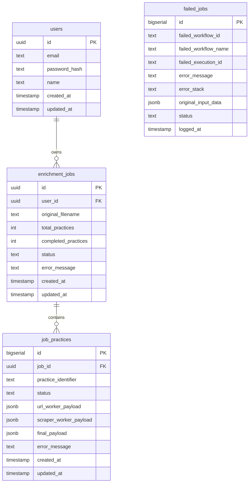
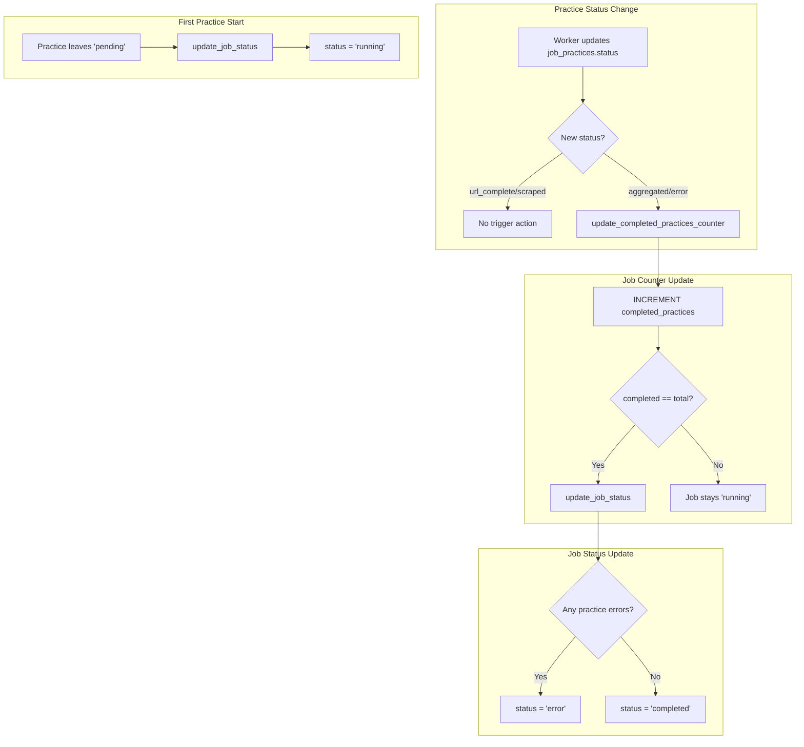

## Entity Relationship Diagram



## Relationship Explanation

### users → enrichment_jobs (One-to-Many)
- Each user can create multiple jobs
- Jobs are scoped to users via RLS policies
- `enrichment_jobs.user_id` references `users.id`

### enrichment_jobs → job_practices (One-to-Many)
- Each job contains multiple practices (one per CSV row)
- Practices cannot exist without a parent job
- `job_practices.job_id` references `enrichment_jobs.id`
- Deleting a job should cascade-delete its practices

### failed_jobs (Standalone)
- Not foreign-keyed to other tables
- Used for logging n8n workflow failures
- Can reference job_id in `original_input_data` but not enforced

---

## Tables

---

## `enrichment_jobs`
Top-level job record created on CSV upload.

| Column | Type | Notes |
|--------|------|-------|
| id | uuid | PK |
| user_id | uuid | FK → users |
| original_filename | text | Uploaded CSV name |
| total_practices | int | Count of practices |
| completed_practices | int | Finished count |
| status | text | pending / running / completed / error |
| error_message | text | Job-level error |
| created_at | timestamp | |
| updated_at | timestamp | |

### Job Status Values

| Status | Meaning |
|--------|---------|
| pending | Job created, no practices started |
| running | At least one practice in progress |
| completed | All practices finished |
| error | Job-level failure |

---

## `job_practices`
Individual practice records within a job.

| Column | Type | Notes |
|--------|------|-------|
| id | bigserial | PK |
| job_id | uuid | FK → enrichment_jobs |
| practice_identifier | text | URL or identifier |
| status | text | pending / url_complete / scraped / aggregated / error |
| url_worker_payload | jsonb | Output from URL worker |
| scraper_worker_payload | jsonb | Output from Scraper worker |
| final_payload | jsonb | Merged final data |
| error_message | text | Practice-level error |
| created_at | timestamp | |
| updated_at | timestamp | |

### Practice Status Values

| Status | Meaning |
|--------|---------|
| pending | Queued, not started |
| url_complete | URL worker finished |
| scraped | Scraper worker finished |
| aggregated | Aggregator finished (terminal) |
| error | Failed at any stage (terminal) |

---

## `failed_jobs`
Workflow-level error logging for debugging.

| Column | Type | Notes |
|--------|------|-------|
| id | bigserial | PK |
| failed_workflow_id | text | n8n workflow ID |
| failed_workflow_name | text | Workflow name |
| failed_execution_id | text | n8n execution ID |
| error_message | text | Error description |
| error_stack | text | Stack trace |
| original_input_data | jsonb | Input that caused failure |
| status | text | Status of the failure record |
| logged_at | timestamp | |

---

## `users`
User accounts for authentication.

| Column | Type |
|--------|------|
| id | uuid |
| email | text |
| password_hash | text |
| name | text |
| created_at | timestamp |
| updated_at | timestamp |

---

## RLS Policies
- Users may only access their own `enrichment_jobs`
- Users may only access `job_practices` for owned jobs
- All API routes use cookie-based auth with RLS-safe Supabase server client

---

## Triggers

Supabase database triggers automatically manage job state:

### `update_enrichment_job_updated_at()`
- Updates `updated_at` timestamp on job modifications
- Triggered on any UPDATE to `enrichment_jobs` table

### `update_completed_practices_counter()`
- Increments `completed_practices` when practice reaches terminal state
- Triggered when `job_practices.status` changes to `aggregated` or `error`

### `update_job_status()`
- Auto-updates job status based on completion:
  - `pending` → `running` (when first practice starts)
  - `running` → `completed` (when all practices finish successfully)
  - `running` → `error` (when appropriate based on practice failures)
- Triggered on practice status changes

### Migration File
Database schema defined in: `migrations/001_create_batch_tables.sql`

---

## Indexes

| Index | Purpose |
|-------|---------|
| `job_practices(job_id)` | Fast lookup of practices by job |
| `job_practices(status)` | Filter practices by processing state |
| `enrichment_jobs(user_id)` | RLS and user job listing |
| `enrichment_jobs(created_at)` | Sort jobs by creation date |
| `job_practices(job_id, status) WHERE status='aggregated'` | Partial index for export queries |

### Index Rationale

**Why partial index on `aggregated` status?**

Export queries only need completed practices:
```sql
SELECT * FROM job_practices 
WHERE job_id = ? AND status = 'aggregated'
```

A partial index avoids indexing `pending`, `url_complete`, `scraped`, and `error` rows that exports never query.

---

## Trigger Flow Diagram



### Trigger Behavior Details

**`update_completed_practices_counter()`**
```sql
-- Pseudocode
AFTER UPDATE ON job_practices
WHEN (NEW.status IN ('aggregated', 'error') AND OLD.status NOT IN ('aggregated', 'error'))
BEGIN
    UPDATE enrichment_jobs 
    SET completed_practices = completed_practices + 1
    WHERE id = NEW.job_id;
END
```

**`update_job_status()`**
```sql
-- Pseudocode
AFTER UPDATE ON job_practices
BEGIN
    -- Set to 'running' when first practice starts
    IF OLD.status = 'pending' AND NEW.status != 'pending' THEN
        UPDATE enrichment_jobs SET status = 'running' WHERE id = NEW.job_id AND status = 'pending';
    END IF;
    
    -- Check for completion
    IF NEW.status IN ('aggregated', 'error') THEN
        UPDATE enrichment_jobs
        SET status = CASE
            WHEN completed_practices = total_practices THEN
                CASE WHEN EXISTS (SELECT 1 FROM job_practices WHERE job_id = NEW.job_id AND status = 'error')
                     THEN 'error' ELSE 'completed' END
            ELSE status
        END
        WHERE id = NEW.job_id;
    END IF;
END
```

---

## JSONB Payload Schemas

### `url_worker_payload`

```json
{
  "normalized_url": "https://example-practice.com",
  "domain": "example-practice.com",
  "status_code": 200,
  "final_url": "https://www.example-practice.com",
  "response_time_ms": 342,
  "processed_at": "2025-01-15T10:30:00Z"
}
```

### `scraper_worker_payload`

```json
{
  "practice_name": "Example Medical Practice",
  "phone": "(555) 123-4567",
  "email": "contact@example-practice.com",
  "address": "123 Main Street, City, ST 12345",
  "specialty": "Family Medicine",
  "provider_count": 5,
  "office_hours": "Mon-Fri 8AM-5PM",
  "scraped_at": "2025-01-15T10:32:00Z"
}
```

### `final_payload`

```json
{
  "practice_identifier": "https://example-practice.com",
  "practice_name": "Example Medical Practice",
  "website": "https://www.example-practice.com",
  "phone": "(555) 123-4567",
  "email": "contact@example-practice.com",
  "address": "123 Main Street, City, ST 12345",
  "specialty": "Family Medicine",
  "provider_count": 5,
  "office_hours": "Mon-Fri 8AM-5PM",
  "domain": "example-practice.com",
  "status_code": 200,
  "response_time_ms": 342,
  "url_processed_at": "2025-01-15T10:30:00Z",
  "scraped_at": "2025-01-15T10:32:00Z",
  "enrichment_metadata": {
    "completeness_percentage": 100,
    "quality_score": "high",
    "fields_filled": 5,
    "fields_missing": 0,
    "enriched_at": "2025-01-15T10:33:00Z"
  }
}
```

### Why JSONB?

1. **Schema flexibility:** Workers can add fields without migrations
2. **Partial updates:** Each worker writes only its payload column
3. **Debugging:** Full provenance of every field across pipeline stages
4. **Query capability:** Can still query/filter on JSONB fields when needed

---

## See Also

- [System Architecture](/docs/architecture/system-overview) - How data flows through the system
- [Error Handling](/docs/architecture/error-handling) - How errors are stored and surfaced
- [Data Extraction](/docs/architecture/data-extraction) - How final_payload fields are merged
