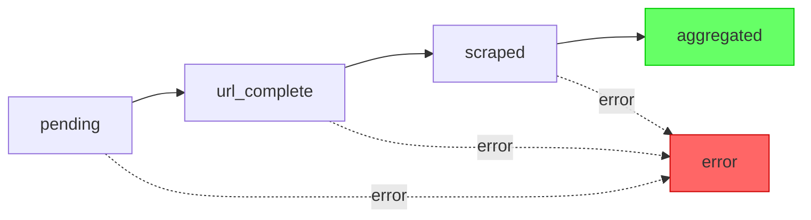

This document provides a unified view of error handling across the LeadDesk 5 system.

## Error States Overview

### Practice-Level Errors

Each practice can independently enter an `error` state at any workflow stage:



### Job-Level Errors

Job status is computed from practice states via database triggers:

| Condition | Job Status |
|-----------|------------|
| All practices `pending` | `pending` |
| Any practice not `pending` | `running` |
| All practices `aggregated` | `completed` |
| All practices terminal AND any `error` | `error` |

A job with mixed results (some `aggregated`, some `error`) will show `error` status but still have exportable data.

---

## Error Types by Stage

### Stage 1: Job Creation (API)

| Error | Cause | Response | Recovery |
|-------|-------|----------|----------|
| Invalid CSV | Malformed file, wrong columns | 400 Bad Request | User re-uploads corrected file |
| Empty CSV | No data rows | 400 Bad Request | User uploads non-empty file |
| Auth failure | Missing/invalid session | 401 Unauthorized | User logs in |
| Dispatcher unreachable | n8n webhook down | 500 Internal Error | Check n8n status, retry |

**Where to look:** Browser console, API response body

### Stage 2: Dispatcher (n8n)

| Error | Cause | Action | Where Logged |
|-------|-------|--------|--------------|
| Supabase query fails | Connection issue, invalid job_id | Job → `error` | `failed_jobs` table |
| No practices found | Job_id mismatch or already processed | Log warning | n8n execution logs |
| URL Worker unreachable | Webhook misconfigured | Job → `error` | `failed_jobs` table |

**Where to look:** n8n execution history, `failed_jobs` table

### Stage 3: URL Worker (n8n)

| Error | Cause | Action | Practice Status |
|-------|-------|--------|-----------------|
| Invalid URL format | Malformed practice_identifier | Mark error | `error` |
| DNS failure | Domain doesn't exist | Mark error | `error` |
| Timeout (5s) | Site unreachable | Retry 3x, then error | `error` if all retries fail |
| HTTP 4xx/5xx | Server error | Log warning, continue | `url_complete` (with warning in payload) |

**Where to look:** `job_practices.error_message`, `job_practices.url_worker_payload`

### Stage 4: Scraper Worker (n8n)

| Error | Cause | Action | Practice Status |
|-------|-------|--------|-----------------|
| Fetch timeout (10s) | Site slow/down | Retry 3x, then error | `error` |
| HTTP 403 | Site blocks scraping | Mark error | `error` |
| HTML parse failure | Malformed page | Log, attempt extraction | `scraped` (partial data) |
| OpenAI API error | Rate limit, quota | Retry with backoff | `error` if all retries fail |
| OpenAI invalid response | Unparseable JSON | Mark partial | `scraped` (with warning) |
| Missing required fields | Extraction incomplete | Mark partial | `scraped` (low quality score) |

**Where to look:** `job_practices.error_message`, `job_practices.scraper_worker_payload`

### Stage 5: Aggregator (n8n)

| Error | Cause | Action | Practice Status |
|-------|-------|--------|-----------------|
| Practice not found | Invalid practice_id | Log error | No change |
| Missing both payloads | URL and Scraper both failed | Mark error | `error` |
| Merge failure | Code bug | Mark error | `error` |

**Where to look:** `job_practices.error_message`, `job_practices.final_payload`

---

## Retry Logic

### Automatic Retries (Built-in)

| Stage | Retry Count | Backoff | Conditions |
|-------|-------------|---------|------------|
| URL Worker | 3 | None (immediate) | Timeout only |
| Scraper Worker (fetch) | 3 | None | Timeout only |
| Scraper Worker (OpenAI) | 3 | 1s, 2s, 5s | Rate limit, API error |

### Manual Retry (User-Initiated)

The `POST /api/redo-job` endpoint enables selective retry:

```bash
POST /api/redo-job
{ "job_id": "550e8400-e29b-41d4-a716-446655440000" }
```

**What it does:**
1. Queries all practices with `status = 'error'`
2. Resets them to `status = 'pending'`
3. Clears `error_message`
4. Re-triggers the Dispatcher webhook

**What it does NOT do:**
- Touch practices that succeeded (`aggregated`)
- Re-process `url_complete` or `scraped` practices
- Reset job-level counters (triggers handle this)

### Manual Cancellation

The `POST /api/kill-job` endpoint stops a running job:

```bash
POST /api/kill-job
{ "job_id": "550e8400-e29b-41d4-a716-446655440000" }
```

**What it does:**
1. Sets `enrichment_jobs.status = 'error'`
2. Stops frontend polling from expecting completion

**What it does NOT do:**
- Kill in-flight n8n executions (they'll complete but DB trigger won't update job status)
- Change individual practice statuses

---

## Where Errors Surface

### 1. Database: `job_practices.error_message`

Primary location for practice-level errors. Contains human-readable error description.

```sql
SELECT id, practice_identifier, status, error_message
FROM job_practices
WHERE job_id = 'xxx' AND status = 'error';
```

### 2. Database: `job_practices.*_payload`

Each payload JSONB may contain partial data or warning flags:

```json
{
  "scraper_worker_payload": {
    "practice_name": "Example Practice",
    "phone": null,
    "_warning": "Could not extract phone number"
  }
}
```

### 3. Database: `failed_jobs` Table

Severe workflow-level failures are logged here:

```sql
SELECT 
    failed_workflow_name,
    error_message,
    error_stack,
    original_input_data,
    logged_at
FROM failed_jobs
ORDER BY logged_at DESC
LIMIT 10;
```

### 4. n8n Execution History

For debugging workflow issues, check n8n's execution logs:

1. Open n8n dashboard
2. Go to Executions
3. Filter by workflow name
4. Find failed executions (red indicator)
5. Click to see node-by-node execution with inputs/outputs

### 5. Frontend: Job Detail Page

The `/jobs/[id]` page shows:
- Job-level status badge
- Practice table with status column
- Expandable error messages for failed practices

---

## Error Handling Best Practices

### For Debugging

1. **Start with the job:** Check `enrichment_jobs.status` and `error_message`
2. **Drill into practices:** Query `job_practices WHERE status='error'`
3. **Check payloads:** Look at `url_worker_payload` and `scraper_worker_payload` for partial data
4. **Check n8n:** If practice never updated, the workflow may have failed silently
5. **Check `failed_jobs`:** For catastrophic failures

### For Recovery

1. **Single practice failure:** Usually retry via `POST /api/redo-job`
2. **Systematic failures:** Check n8n configuration (webhooks, API keys)
3. **Rate limit errors:** Wait and retry, or adjust batch size
4. **Data quality issues:** May need to fix upstream CSV data

### For Monitoring

Key metrics to track:
- Error rate per job: `COUNT(status='error') / total_practices`
- Error rate by stage: Which workflow fails most often?
- OpenAI error rate: Rate limits hitting?
- Average practices per error: Is it isolated or systemic?

---

## Error Codes Reference

### HTTP Status Codes (API)

| Code | Meaning | Common Cause |
|------|---------|--------------|
| 400 | Bad Request | Invalid CSV, missing parameters |
| 401 | Unauthorized | Session expired |
| 403 | Forbidden | RLS policy violation |
| 404 | Not Found | Invalid job_id |
| 500 | Internal Server Error | Supabase down, webhook failure |

### Practice Error Messages

| Message Pattern | Stage | Cause |
|-----------------|-------|-------|
| `Invalid URL format` | URL Worker | Malformed practice_identifier |
| `DNS resolution failed` | URL Worker | Domain doesn't exist |
| `Request timeout` | URL Worker / Scraper | Site unreachable |
| `HTTP 403/404` | Scraper | Site blocks access |
| `OpenAI API error: *` | Scraper | API failure (see details) |
| `Insufficient data for aggregation` | Aggregator | Both URL and Scraper failed |

---

## See Also

- [Debugging Runbook](/docs/debugging-runbook) - Step-by-step troubleshooting
- [System Architecture](/docs/architecture/system-overview) - How components connect
- [Database Schema](/docs/architecture/database-schema) - Table structures
