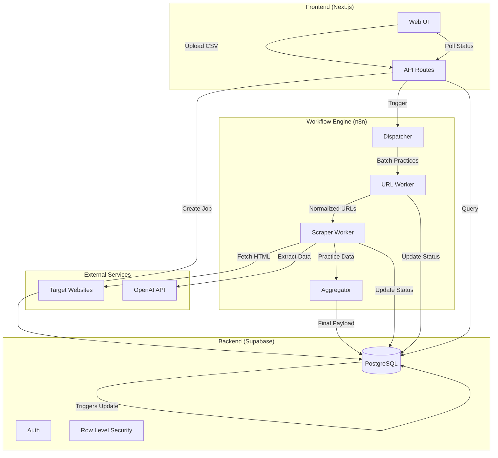
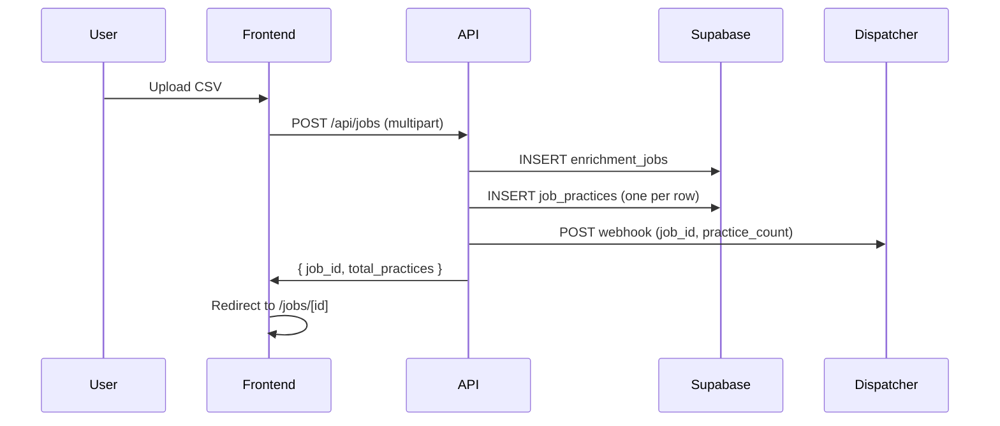
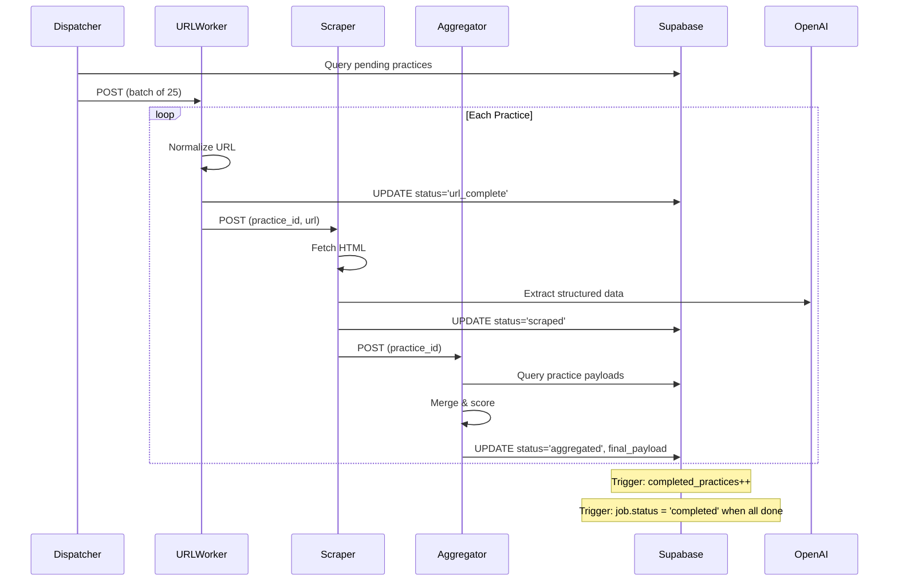
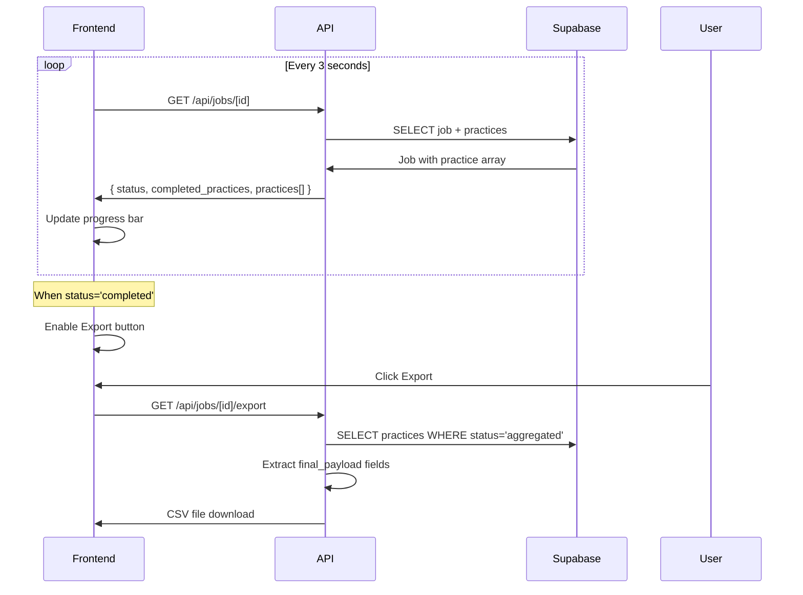

LeadDesk 5 is a dental practice data enrichment platform with three main components: a Next.js frontend, Supabase backend, and n8n workflow engine.

## High-Level Architecture



## Component Responsibilities

### Frontend (Next.js)

| Component | Purpose |
|-----------|---------|
| `/jobs/new` | CSV upload interface |
| `/jobs` | Job list with status |
| `/jobs/[id]` | Real-time job detail with practice table |
| API Routes | CRUD operations, export generation, webhook triggers |

The frontend is stateless. All state lives in Supabase; the UI polls for updates.

### Backend (Supabase)

| Component | Purpose |
|-----------|---------|
| `enrichment_jobs` | Batch-level metadata (filename, counts, status) |
| `job_practices` | Per-practice state and payloads |
| `failed_jobs` | Workflow error logging |
| Triggers | Auto-update job status based on practice completion |
| RLS Policies | User isolation (users only see their own jobs) |

Supabase is the source of truth. Workers write directly to it; triggers handle state transitions.

### Workflow Engine (n8n)

| Workflow | Input | Output | Triggers |
|----------|-------|--------|----------|
| **Dispatcher** | `job_id`, `practice_count` | Batched practice lists | URL Worker |
| **URL Worker** | Practice batch | `url_worker_payload` | Scraper Worker |
| **Scraper Worker** | Practice ID, URL | `scraper_worker_payload` | Aggregator |
| **Aggregator** | Practice ID | `final_payload` | (DB trigger handles job completion) |

---

## Data Flow: End-to-End

### 1. Job Creation



### 2. Practice Processing



### 3. Status Polling & Export



---

## Workflow Interconnections

The four n8n workflows form a pipeline where each worker hands off to the next:

```
                    ┌─────────────────────────────────────────────────────────┐
                    │                                                         │
┌──────────┐   ┌────▼─────┐   ┌─────────────┐   ┌─────────────┐   ┌──────────▼──┐
│ Backend  │──▶│Dispatcher│──▶│ URL Worker  │──▶│   Scraper   │──▶│ Aggregator  │
│ (API)    │   │          │   │             │   │   Worker    │   │             │
└──────────┘   └──────────┘   └──────────────┘   └─────────────┘   └─────────────┘
     │              │                │                  │                 │
     │              │                │                  │                 │
     ▼              ▼                ▼                  ▼                 ▼
┌─────────────────────────────────────────────────────────────────────────────────┐
│                              Supabase (PostgreSQL)                              │
│                                                                                 │
│  enrichment_jobs          job_practices                    failed_jobs         │
│  ┌─────────────┐          ┌────────────────────────────┐   ┌───────────────┐   │
│  │ id          │          │ id                         │   │ error_message │   │
│  │ status      │◄─trigger─│ status                     │   │ workflow_id   │   │
│  │ completed   │          │ url_worker_payload         │   │ input_data    │   │
│  │ total       │          │ scraper_worker_payload     │   └───────────────┘   │
│  └─────────────┘          │ final_payload              │                       │
│                           └────────────────────────────┘                       │
└─────────────────────────────────────────────────────────────────────────────────┘
```

### Trigger Chain

| Step | Trigger | Action |
|------|---------|--------|
| 1 | `POST /api/jobs` | Backend creates job, fires Dispatcher webhook |
| 2 | Dispatcher webhook | Queries practices, batches, fires URL Worker webhook |
| 3 | URL Worker completes | Fires Scraper Worker webhook per practice |
| 4 | Scraper Worker completes | Fires Aggregator webhook per practice |
| 5 | Aggregator completes | Updates `status='aggregated'`, DB trigger increments counter |
| 6 | All practices done | DB trigger sets `job.status='completed'` |

### Error Paths

At any stage, a worker can:
1. Set `practice.status = 'error'`
2. Write `practice.error_message`
3. Optionally log to `failed_jobs` for severe errors

The pipeline stops for that practice but continues for others.

---

## Key Design Principles

### 1. Eventual Consistency via Polling
Frontend polls every 3 seconds. No WebSockets needed. Simple, reliable, good enough for batch workloads.

### 2. Workers Write Directly to DB
Workers don't return data to the dispatcher. They write to Supabase directly and fire the next webhook. This keeps payloads small and enables independent retries.

### 3. Triggers Handle Coordination
Job-level status (`running` → `completed`) is managed by database triggers, not application code. This eliminates race conditions and keeps workers simple.

### 4. Each Stage Preserves State
Every worker writes its output to a dedicated JSONB column. If a later stage fails, earlier data is preserved. This enables debugging and partial recovery.

### 5. Stateless Frontend
No client-side state beyond the current view. Refresh the page and you get the same data. All truth lives in Supabase.

---

## Environment Configuration

The system requires these connections to be configured:

```bash
# Frontend → Supabase
NEXT_PUBLIC_SUPABASE_URL=https://xxx.supabase.co
NEXT_PUBLIC_SUPABASE_ANON_KEY=eyJ...

# Backend → n8n
LD5_DISPATCHER_WEBHOOK_URL=https://n8n.example.com/webhook/dispatcher

# n8n → Supabase
SUPABASE_URL=https://xxx.supabase.co
SUPABASE_SERVICE_KEY=eyJ...

# n8n → OpenAI
OPENAI_API_KEY=sk-...

# n8n internal webhooks
N8N_URL_WORKER_WEBHOOK=https://n8n.example.com/webhook/url-worker
N8N_SCRAPER_WEBHOOK=https://n8n.example.com/webhook/scraper
N8N_AGGREGATOR_WEBHOOK=https://n8n.example.com/webhook/aggregator
```

---

## Further Reading

- [LD4 to LD5 Evolution](/docs/architecture/evolution) - Why we built it this way
- [Database Schema](/docs/architecture/database-schema) - Table structures and triggers
- [Workflow Details](/docs/workflows/overview) - Deep dive into each n8n workflow
- [Error Handling](/docs/architecture/error-handling) - How errors propagate and surface
