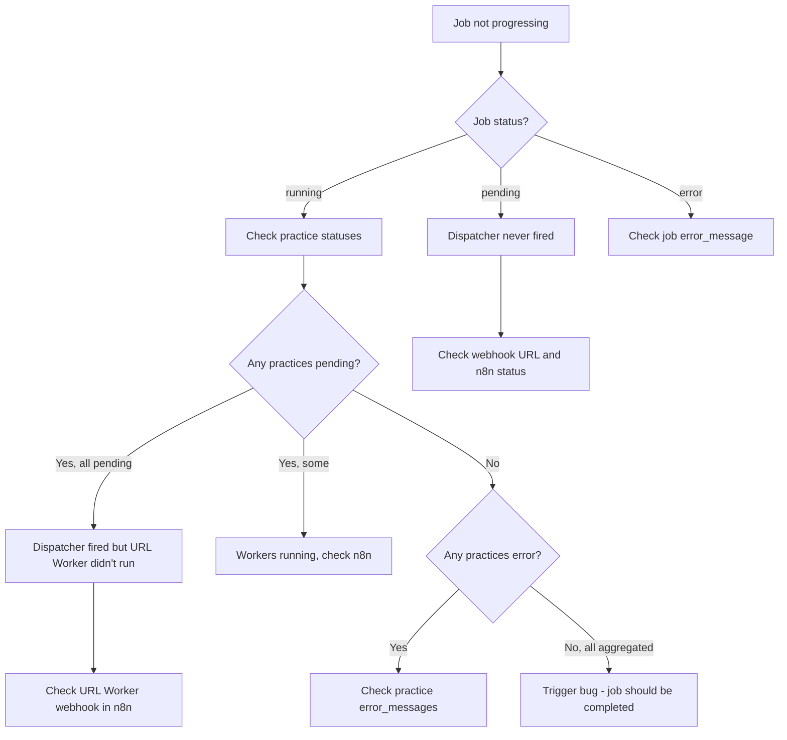

# Debugging Runbook

This runbook covers the most common failure scenarios in LeadDesk 5 and how to diagnose and fix them.

## Quick Diagnosis Flowchart



---

## Scenario 1: Job Stuck in `pending`

**Symptom:** Job created but status never changes from `pending`. No practices processing.

### Diagnosis Steps

1. **Check if Dispatcher webhook was called:**
   ```bash
   # In n8n, check Dispatcher workflow executions
   # Look for execution with the job_id
   ```

2. **Check webhook URL configuration:**
   ```bash
   # Verify environment variable
   echo $LD5_DISPATCHER_WEBHOOK_URL
   ```

3. **Check Supabase logs for the API call:**
   - Go to Supabase Dashboard → Logs → API
   - Filter by `/api/jobs`
   - Look for the POST request and response

### Common Causes

| Cause | Fix |
|-------|-----|
| `LD5_DISPATCHER_WEBHOOK_URL` not set | Add to `.env.local` and restart |
| n8n instance down | Check n8n container/service status |
| Webhook URL incorrect | Verify URL matches n8n webhook path |
| Network issue | Check if backend can reach n8n |

### Fix

```bash
# 1. Fix webhook URL
LD5_DISPATCHER_WEBHOOK_URL=https://your-n8n.com/webhook/dispatcher

# 2. Manually trigger dispatcher (if job exists)
curl -X POST $LD5_DISPATCHER_WEBHOOK_URL \
  -H "Content-Type: application/json" \
  -d '{"job_id": "YOUR_JOB_ID", "practice_count": 50}'
```

---

## Scenario 2: Job Stuck in `running`

**Symptom:** Job shows `running` but progress stopped. Some practices still `pending` or stuck in intermediate state.

### Diagnosis Steps

1. **Check practice status distribution:**
   ```sql
   SELECT status, COUNT(*) 
   FROM job_practices 
   WHERE job_id = 'YOUR_JOB_ID'
   GROUP BY status;
   ```

2. **Identify stuck practices:**
   ```sql
   SELECT id, practice_identifier, status, updated_at
   FROM job_practices
   WHERE job_id = 'YOUR_JOB_ID'
     AND status NOT IN ('aggregated', 'error')
   ORDER BY updated_at ASC;
   ```

3. **Check n8n execution history:**
   - Look for failed or stuck executions
   - Check if workers are receiving webhook calls

### Common Causes by Practice Status

| Stuck Status | Likely Cause | Where to Look |
|--------------|--------------|---------------|
| `pending` | URL Worker not triggered | Dispatcher executions |
| `url_complete` | Scraper Worker not triggered | URL Worker executions |
| `scraped` | Aggregator not triggered | Scraper Worker executions |

### Fix

```bash
# Option 1: Re-trigger dispatcher for pending practices only
curl -X POST /api/redo-job \
  -H "Content-Type: application/json" \
  -d '{"job_id": "YOUR_JOB_ID"}'

# Option 2: Manually trigger worker for specific practice
# (Get practice_id from stuck practice query above)
curl -X POST $N8N_SCRAPER_WEBHOOK \
  -H "Content-Type: application/json" \
  -d '{"practice_id": 123, "url": "https://example.com"}'
```

---

## Scenario 3: Practices Failing with URL Errors

**Symptom:** Multiple practices showing `error` status with URL-related error messages.

### Diagnosis Steps

1. **Check error messages:**
   ```sql
   SELECT practice_identifier, error_message
   FROM job_practices
   WHERE job_id = 'YOUR_JOB_ID'
     AND status = 'error'
     AND error_message LIKE '%URL%' OR error_message LIKE '%DNS%';
   ```

2. **Verify URL format in CSV:**
   - Check original `practice_identifier` values
   - Look for typos, extra spaces, invalid characters

### Common Causes

| Error Message | Cause | Fix |
|---------------|-------|-----|
| `Invalid URL format` | Malformed identifier | Fix CSV data |
| `DNS resolution failed` | Domain doesn't exist | Verify domain, fix CSV |
| `Request timeout` | Site unreachable | Check if site is up, retry later |
| `HTTP 403` | Site blocks requests | May need different User-Agent |

### Fix

For bad source data, no automated fix - re-upload corrected CSV.

For transient issues:
```bash
# Retry failed practices
curl -X POST /api/redo-job \
  -H "Content-Type: application/json" \
  -d '{"job_id": "YOUR_JOB_ID"}'
```

---

## Scenario 4: Practices Failing at Scraper Stage

**Symptom:** Practices reach `url_complete` but fail to reach `scraped`.

### Diagnosis Steps

1. **Check scraper errors:**
   ```sql
   SELECT 
       practice_identifier,
       error_message,
       url_worker_payload->>'normalized_url' as url
   FROM job_practices
   WHERE job_id = 'YOUR_JOB_ID'
     AND status = 'error'
     AND url_worker_payload IS NOT NULL;
   ```

2. **Check n8n Scraper Worker logs:**
   - Look for OpenAI API errors
   - Check for fetch failures

### Common Causes

| Error Message | Cause | Fix |
|---------------|-------|-----|
| `OpenAI API error: rate_limit` | Hit API rate limit | Wait 60s, retry |
| `OpenAI API error: insufficient_quota` | Out of credits | Add OpenAI credits |
| `Fetch timeout` | Site too slow | Increase timeout or skip |
| `HTTP 403/404` | Site blocks scraping | Manual data entry needed |
| `Parse error` | Malformed HTML | Usually still extracts partial data |

### Fix

```bash
# Check OpenAI API status
curl https://api.openai.com/v1/models \
  -H "Authorization: Bearer $OPENAI_API_KEY"

# If rate limited, wait and retry
sleep 60
curl -X POST /api/redo-job -d '{"job_id": "YOUR_JOB_ID"}'
```

---

## Scenario 5: Job Shows `error` but Some Practices Succeeded

**Symptom:** Job status is `error` but some practices are `aggregated`.

### This is Expected Behavior

A job shows `error` if ANY practice failed. The successful practices are still exportable.

### Diagnosis Steps

1. **Check success rate:**
   ```sql
   SELECT 
       COUNT(*) FILTER (WHERE status = 'aggregated') as succeeded,
       COUNT(*) FILTER (WHERE status = 'error') as failed,
       COUNT(*) as total
   FROM job_practices
   WHERE job_id = 'YOUR_JOB_ID';
   ```

2. **Export successful practices:**
   - Export still works! Just downloads `aggregated` practices.
   - `GET /api/jobs/[id]/export`

### Options

1. **Accept partial results:** Export what succeeded
2. **Retry failures:** `POST /api/redo-job`
3. **Investigate specific failures:** Check error_message for patterns

---

## Scenario 6: Export Returns Empty or Partial Data

**Symptom:** CSV export has missing columns or empty fields.

### Diagnosis Steps

1. **Check practice final_payloads:**
   ```sql
   SELECT 
       id,
       final_payload->>'practice_name' as name,
       final_payload->>'phone' as phone,
       final_payload->'enrichment_metadata'->>'quality_score' as quality
   FROM job_practices
   WHERE job_id = 'YOUR_JOB_ID'
     AND status = 'aggregated';
   ```

2. **Check quality scores:**
   ```sql
   SELECT 
       final_payload->'enrichment_metadata'->>'quality_score' as quality,
       COUNT(*)
   FROM job_practices
   WHERE job_id = 'YOUR_JOB_ID'
     AND status = 'aggregated'
   GROUP BY 1;
   ```

### Common Causes

| Issue | Cause | Resolution |
|-------|-------|------------|
| All fields null | Scraper extraction failed | Check scraper_worker_payload for errors |
| Low quality scores | Site has minimal info | Expected for some practices |
| Specific field null | Field not present on website | Expected - not all sites have all info |

### This is Often Not a Bug

Some practices simply don't have complete data available. Check `quality_score`:
- `high`: 80-100% complete
- `medium`: 50-79% complete
- `low`: <50% complete

---

## Scenario 7: n8n Workflow Execution Errors

**Symptom:** n8n shows failed executions in the execution list.

### Diagnosis Steps

1. **Open n8n Dashboard**
2. **Go to Executions**
3. **Filter by failed (red indicator)**
4. **Click execution to see details**
5. **Find the failed node**
6. **Check input data and error message**

### Common n8n Issues

| Failed Node | Common Cause | Fix |
|-------------|--------------|-----|
| Webhook | Usually not the issue | Check what called it |
| Supabase | Connection/auth issue | Verify SUPABASE_SERVICE_KEY |
| HTTP Request | Target site issue | Check URL, headers |
| OpenAI | API key or quota | Check OPENAI_API_KEY |
| Function | Code bug | Check JavaScript error |

### Supabase Connection Fix

```bash
# Verify service key works
curl 'https://YOUR_PROJECT.supabase.co/rest/v1/enrichment_jobs?limit=1' \
  -H "apikey: YOUR_SERVICE_KEY" \
  -H "Authorization: Bearer YOUR_SERVICE_KEY"
```

---

## Scenario 8: Database Trigger Not Updating Job Status

**Symptom:** All practices `aggregated` but job still shows `running`.

### Diagnosis Steps

1. **Verify practice counts:**
   ```sql
   SELECT 
       ej.total_practices,
       ej.completed_practices,
       ej.status as job_status,
       COUNT(jp.id) as actual_practices,
       COUNT(jp.id) FILTER (WHERE jp.status IN ('aggregated', 'error')) as terminal
   FROM enrichment_jobs ej
   LEFT JOIN job_practices jp ON jp.job_id = ej.id
   WHERE ej.id = 'YOUR_JOB_ID'
   GROUP BY ej.id;
   ```

2. **Check if counts match:**
   - `total_practices` should equal `actual_practices`
   - `completed_practices` should equal `terminal`

### Common Causes

| Issue | Cause | Fix |
|-------|-------|-----|
| `completed_practices` < terminal | Trigger didn't fire | Manual update |
| `total_practices` wrong | Bug in job creation | Manual update |
| Trigger disabled | Migration issue | Re-enable trigger |

### Manual Fix

```sql
-- Update completed count
UPDATE enrichment_jobs
SET completed_practices = (
    SELECT COUNT(*) FROM job_practices
    WHERE job_id = 'YOUR_JOB_ID'
      AND status IN ('aggregated', 'error')
)
WHERE id = 'YOUR_JOB_ID';

-- Update job status
UPDATE enrichment_jobs
SET status = CASE
    WHEN (SELECT COUNT(*) FROM job_practices WHERE job_id = 'YOUR_JOB_ID' AND status = 'error') > 0 THEN 'error'
    ELSE 'completed'
END
WHERE id = 'YOUR_JOB_ID';
```

---

## Diagnostic Queries Cheat Sheet

```sql
-- Job overview
SELECT id, status, total_practices, completed_practices, created_at
FROM enrichment_jobs
WHERE id = 'JOB_ID';

-- Practice status breakdown
SELECT status, COUNT(*) 
FROM job_practices 
WHERE job_id = 'JOB_ID'
GROUP BY status;

-- Failed practices with details
SELECT id, practice_identifier, error_message, updated_at
FROM job_practices
WHERE job_id = 'JOB_ID' AND status = 'error';

-- Stuck practices (not updated recently)
SELECT id, practice_identifier, status, updated_at
FROM job_practices
WHERE job_id = 'JOB_ID'
  AND status NOT IN ('aggregated', 'error')
  AND updated_at < NOW() - INTERVAL '5 minutes';

-- Quality score distribution
SELECT 
    final_payload->'enrichment_metadata'->>'quality_score' as quality,
    COUNT(*)
FROM job_practices
WHERE job_id = 'JOB_ID' AND status = 'aggregated'
GROUP BY 1;

-- Recent workflow failures
SELECT workflow_name, error_message, logged_at
FROM failed_jobs
ORDER BY logged_at DESC
LIMIT 10;
```

---

## When to Escalate

Contact the system owner if:

1. **Triggers are broken:** Job status never updates despite correct practice counts
2. **n8n is down:** Workflows not executing at all
3. **Supabase unreachable:** Connection errors across the board
4. **OpenAI quota exhausted:** Need to add credits
5. **Systematic extraction failures:** Same error for all practices (likely prompt issue)

---

## See Also

- [Error Handling Reference](/docs/architecture/error-handling) - Error types and states
- [System Architecture](/docs/architecture/system-overview) - Component overview
- [Workflow Details](/docs/workflows/overview) - n8n workflow specifics
