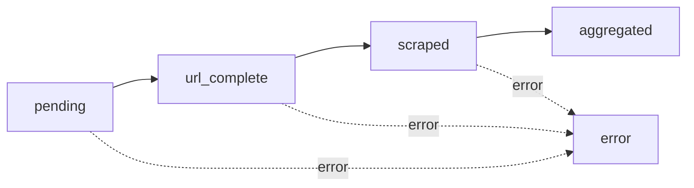

# LeadDesk 5 Workflows

## Overview
LeadDesk 5 uses n8n to orchestrate asynchronous batch processing through a dispatcher and three specialized worker workflows.


## Workflow Components


  Receives jobs and distributes practices to workers in batches


  Normalizes and validates practice URLs


  Extracts practice data using OpenAI


  Combines data and produces final enriched payload


## Processing Flow


  
    Frontend calls POST `/api/jobs` with CSV file
  
  
  
    Backend triggers Dispatcher webhook with `job_id` and `practice_count`
  
  
  
    Dispatcher chunks practices into groups of 10-25 and triggers URL Worker
  
  
  
    URL Worker normalizes each practice URL and validates domains
  
  
  
    Scraper Worker fetches and extracts practice data using OpenAI
  
  
  
    Aggregator Worker combines all payloads into final enriched data
  
  
  
    Database triggers update job status to `completed`
  


## Status Transitions

Practice status flows through these states:



| Status | Description |
|--------|-------------|
| `pending` | Practice awaiting URL worker |
| `url_complete` | URL normalized and validated |
| `scraped` | Practice data extracted |
| `aggregated` | Final enrichment complete |
| `error` | Processing failed at any stage |

## Error Handling

All workers implement error handling:

- **Retry Logic**: Failed practices can be retried
- **Error Messages**: Detailed error info stored in `error_message` field
- **Failed Jobs Table**: Critical failures logged to `failed_jobs`
- **Job Status**: Any practice error can trigger job-level `error` status

## Configuration

Workflow webhooks are configured via environment variables:

```bash
# Dispatcher
LD5_DISPATCHER_WEBHOOK_URL=https://n8n.example.com/webhook/dispatcher

# Workers (called by dispatcher)
N8N_URL_WORKER_WEBHOOK=https://n8n.example.com/webhook/url-worker
N8N_SCRAPER_WEBHOOK=https://n8n.example.com/webhook/scraper
N8N_AGGREGATOR_WEBHOOK=https://n8n.example.com/webhook/aggregator
```

## Performance Considerations

- **Batch Size**: 10-25 practices per batch (configurable)
- **Concurrency**: Workers process batches in parallel
- **Rate Limiting**: Implement delays between scraping requests
- **Resource Usage**: Monitor n8n instance CPU/memory

## Next Steps


  Configure the dispatcher workflow


  Set up URL normalization


  Configure OpenAI scraping


  Set up data aggregation


